<h1 align="center"> UI FREQTRADE</h1>
​
​

Proyecto Final, interfaz grafica para Freqtrade

​

Proyecto de creacion de la web tanto en fronted y backend.
 
Desarrollada como formacion del Bootcamp de Full Stack Developer de Geekshubs Academy.

​
​

​
​
<h5 align="center"> Tecnologías utilizadas</h1>
​

JavaScript,
TypeScript, node, express, TypeOrm, ThunderClient, HTML5, CSS3, Bootstrap, React, GIT y GitHUB

  <tr >
    <td valign="top"></td>
    <td valign="top"></td>
    <td valign="top"></td>
    <td></td>
     <td valign="top"></td>
      <td valign="top"></td>
      <td valign="top"></td>
      <td valign="top"></td>
      <td valign="top"></td>
      <td valign="top"></td>
    <td valign="top"></td>
    <td valign="top"></td>
    <td></td>
     <td valign="top"></td>
     <td valign="top"></td>
  
  

## Tabla de contenidos

​

- [👩🏻‍💻 Descripción del proyecto]
- [🔍 Observaciones]
- [⚖️ Licencia y Copyright]
- [📚Instrucciones]
  ​
  ​

### Instrucciones
1. Accede a la url del frontend: `URL`.

2. Clona el reposito , UI-Freqtrade, en tu máquina local usando el siguiente comando: `git clone [https://github.com/BGMiralles/UI-Freqtrade.git]`.

3. Ejecuta el comando `npm run dev` en la consola de la carpeta `/backend`, para levantar el servidor backend.

5. Disfruta de una página web completamente funcional, registrate, crea estrategias, explora y modifica tus propias estrategias.

### Descripción

​
Proyecto creado durante 2 semanas, consiste en una web completamente funcional para gestionar y crear tus estrategias de inversion. Tanto a nivel de frontend como de backend.

Consta de las siguientes funcionalidades.

Registro de usuarios.

Login y LogOut de usuarios.

Creacion - Eliminacion y modificacion de estrategias.

Panel de usuario y de admin.

Galeria de estrategias.

Galeria de indicadores tecnicos.

Diferentes vistas de informacion de la aplicacion.

Consulta a BBDD

Conexion a Redes sociales.

## Esquema de la BBDD:

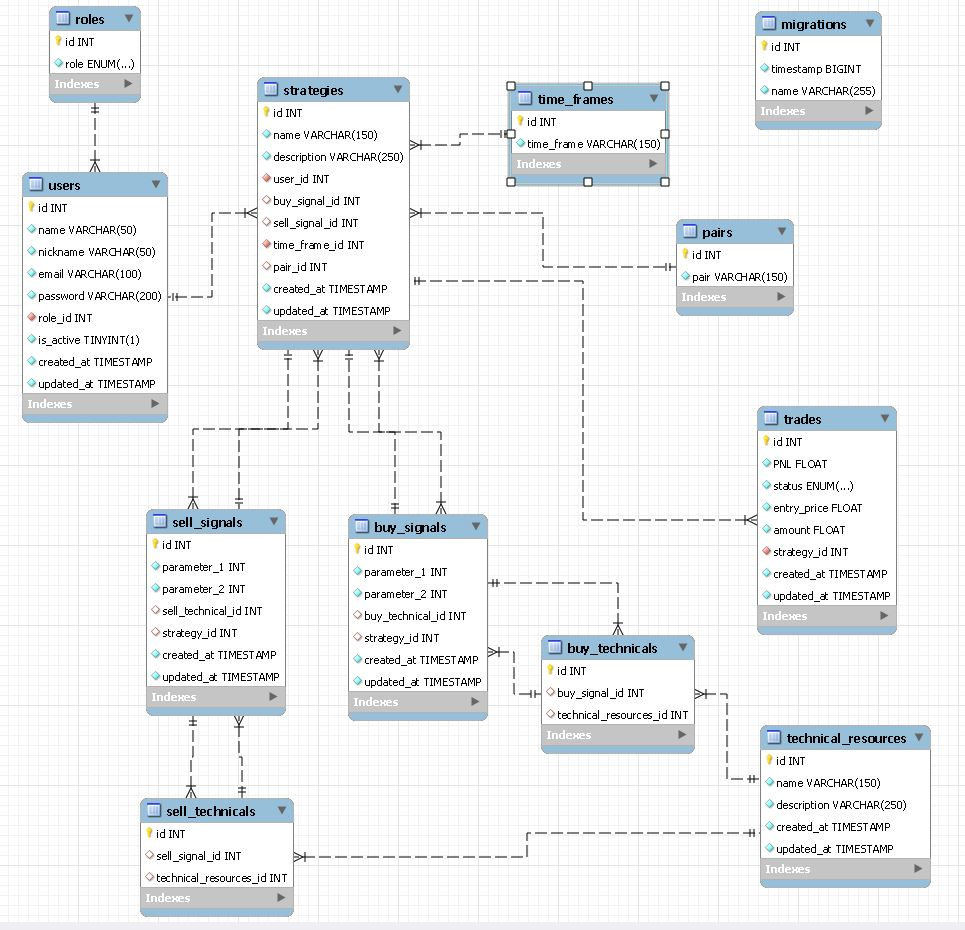

## Como utilizar la API:

**Instalar node**  
**instalar express**  
**instalar typeORM**  
**instalar postman o la extension de VSCODE Thunderclient**  
**instalar dotenv**  

#### SCRIPTS EN EL PACKAGE JSON

"dev": "nodemon ./src/index.ts",  
    "build": "tsc",  
    "start": "node ./build/index.js"

ejecutar el comando **npm run dev** en el terminal

Lo primero usar el archivo de seeder `npx ./src/Seeder/fakeSeed.ts`, crear un usuario y hardcodearlo en la BBDD directamnte con el role **super_admin**.

Esto nos permitira en un futuro poder tener acceso a ciertos endpoints, ya que no vamos a permitir que todos los usuarios ya sean users o super admins tengan acceso a toda la informacion.

el email de los usuarios siempre va a ser **nombre@example.com**
la contraseña siempre es el **Nombre123$**

##### Endpoints:

###### Endpoints para user:

localhost:3000/user

> /register TIPO: **POST** : crear usuarios
>
> > AUTH: nada  
> > BODY
> >
> > > {  
> > > "name":"your name",  
> > > "email":"your email",  
> > > "password":"your password",  
> > > "nickname":"your nickname"  
> > > }

> /login TIPO: **POST**: logear usuarios
>
> > AUTH: nada  
> > BODY
> >
> > > {  
> > > “Email”:”your email”  
> > > “Password:”your password”  
> > > }

> /profile TIPO: **GET**: obtener tu perfil de usuario
>
> > AUTH: token tipo bearer obtenido al hacer el login  
> > BODY: nada

> /update TIPO: **PUT**: modificar usuarios
>
> > AUTH: token tipo bearer obtenido al hacer el login  
> > BODY
> >
> > > 
> > > {  
> > > "username":"your name",  
> > > "email":"your mail",  
> > > "nickname":"your nickname"  
> > > }

###### Endpoints para strategy:

localhost:3000/strategy

> /getMyStrategies TIPO: **GET**: ver tus estrategias como usuario
>
> > AUTH: token tipo bearer obtenido al hacer el login  
> > BODY: nada

> /allStrategies TIPO: **GET**: ver todas las estrategias por el role minimo de super admin
>
> > AUTH: token tipo bearer  obtenido al hacer el login  
> > BODY: nada

> /deleteStrategy TIPO: **DELETE**: eliminar una estrategia por el usuario
>
> > AUTH: token tipo bearer  
> > BODY: 
> >
> > >{
> > >  "id": "strategy id to eliminate" 
> > >}

> /updateStrategy TIPO: **PUT**: modificar una estrategia del usuario
>
> > AUTH: token tipo bearer  
> > BODY: 
> >
> > >{
> > >"parameter_1_buy": number,
> > >"parameter_2_buy": number,
> > >"parameter_1_sell": number,
> > >"parameter_2_sell": number,
> > >"time_frame_id": number,
> > >"name": "name",
> > >"description": "description",
> > >"buy_technical_resources_id": number,
> > >"sell_technical_resources_id": number,
> > >"id": number
> > >}

> /createStrategy TIPO: **POST**: crear una estrategia del usuario
>
> > AUTH: token tipo bearer  
> > BODY: 
> >
> > >{
> > >"parameter_1_buy": number,
> > >"parameter_2_buy": number,
> > >"parameter_1_sell": number,
> > >"parameter_2_sell": number,
> > >"time_frame_id": number,
> > >"name": "name",
> > >"description": "description",
> > >"buy_technical_resources_id": number,
> > >"sell_technical_resources_id": number,
> > >}

###### Endpoints para roles:

localhost:3000/role

> /createRole TIPO: **POST** : crear role
>
> > AUTH: token tipo bearer obtenido al hacer el login, minimo super admin 
> > BODY
> >
> > > {  
> > >  "role": ""role
> > > }

> /updateRole TIPO: **PUT** : actualizar role
>
> > AUTH: token tipo bearer obtenido al hacer el login, minimo super admin 
> > BODY
> >
> > > { 
> > > "id": role_id,
> > > "role": "role" 
> > > }

> /deleteRole TIPO: **DELETE** : eliminar role
>
> > AUTH: token tipo bearer obtenido al hacer el login, minimo super admin 
> > BODY
> >
> > > {  
> > >  “id”:role_id  
> > > }

> /allRoles TIPO: **DELETE** : recuperar todos los roles
>
> > AUTH: token tipo bearer obtenido al hacer el login, minimo super admin 
> > BODY: nada

###### Endpoints para Technicals Resources:

localhost:3000/technicalresource

> /createTechnicalResource TIPO: **POST** : crear nuevos indicadores tecnicos
>
> > AUTH: token tipo bearer obtenido al hacer el login, solo sirve el de super admin.  
> > BODY
> >
> > > {  
> > > "name":" name",  
> > > "description":"your description"
> > > }

> /updateTechnicalResource TIPO: **PUT** : Modificar indicador
>
> > AUTH: token tipo bearer obtenido al hacer el login, solo sirve el de super admin.   
> > BODY
> >
> > > {  
> > > "name":"name",  
> > > "description":"your description"
> > > "id":"technical id"
> > > }

> /getAllTechnicalResources TIPO: **GET** : ver todos los indicadores
>
> > AUTH: token tipo bearer obtenido al hacer el login
> > BODY: nada

> /deleteTechnicalResource TIPO: **DELETE** : borrar indicador
> >
> > AUTH: token tipo bearer obtenido al hacer el login, minimo super admin 
> > BODY
> >
> > > {
> > > "id": "technical id"
> > > }

###### Endpoints para times frames:

localhost:3000/timeframe

> /createTimeFrame TIPO: **POST** : crear time frame
>
> > AUTH: token tipo bearer obtenido al hacer el login, solo sirve el de level admin o super admin  
> > BODY
> >
> > > {  
> > >  "time_frame": "time frame"
> > > }

> /getAllTimeFrames TIPO: **GET** : recuperar todos los times frames
>
> > AUTH: token tipo bearer obtenido al hacer el login   
> > BODY: nada

> /deleteTimeFrame TIPO: **DELETE** : Eliminar un time frame
>
> > AUTH: token tipo bearer obtenido al hacer el login, solo sirve el de level super admin  
> > BODY: 
> >
> > > {  
> > >  "id": time_frame_id,  
> > > }

###### Endpoints para super admin:

localhost:3000/superadmin

> /update TIPO: **PUT** : Modificar role de usuario
>
> > AUTH: token tipo bearer obtenido al hacer el login, solo sirve el de super admin.   
> > BODY
> >
> > > {  
> > > "role_id":"role id"
> > > "id":"user id"
> > > }

> /all TIPO: **GET** : recuperar todos los usuarios
>
> > AUTH: token tipo bearer obtenido al hacer el login minimo super admin   
> > BODY: nada

## Aqui las diferentes vistas de la aplicacion:

###### Menu principal:

Vista principal
Aqui puedes ver toda la pagina en general, con sus diferentes secciones

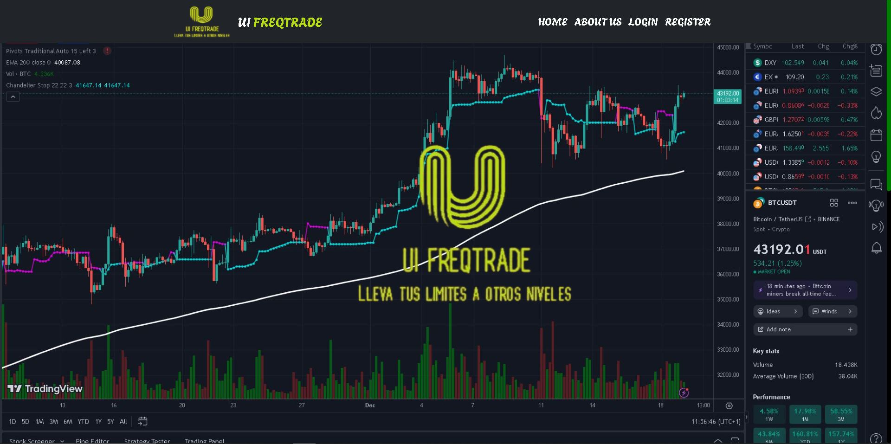
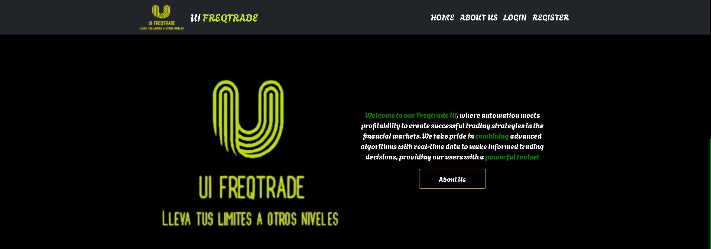
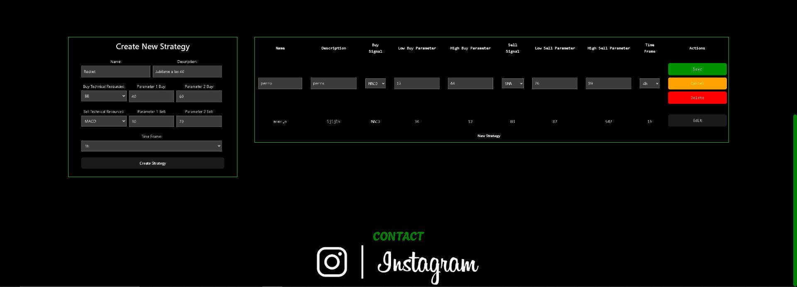

###### About US

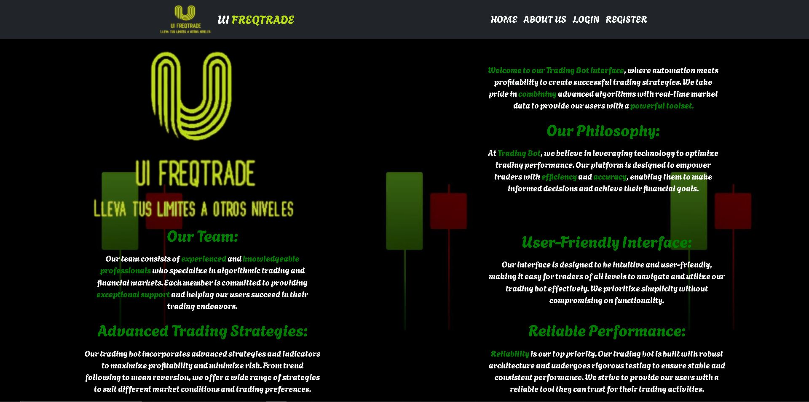

###### Login

Vista del Login

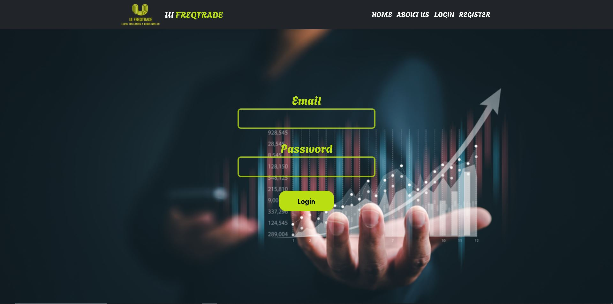

###### Register

Vista del Register

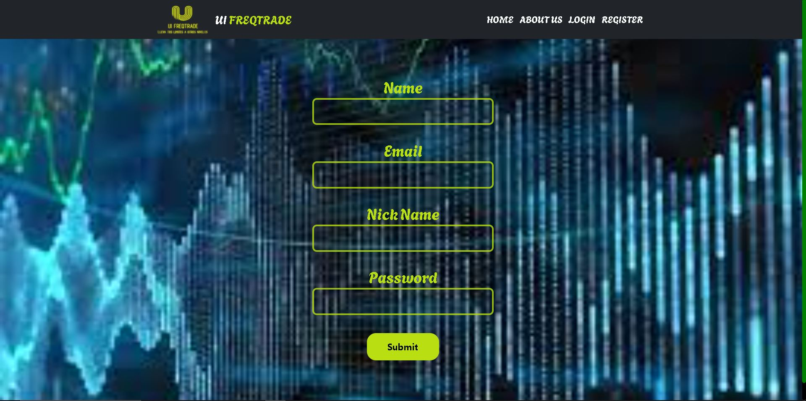

###### Panel de usuario

Vista del Perfil

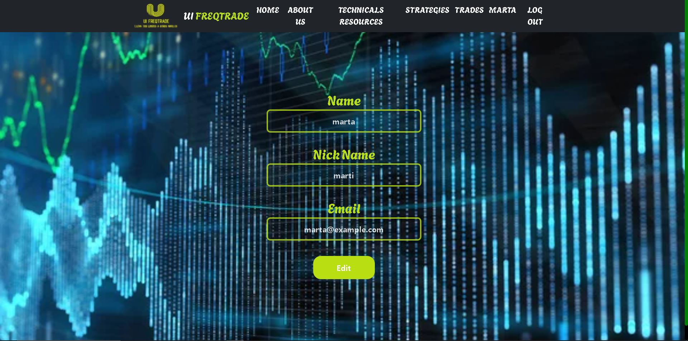

Vista pestaña Technicals Resources

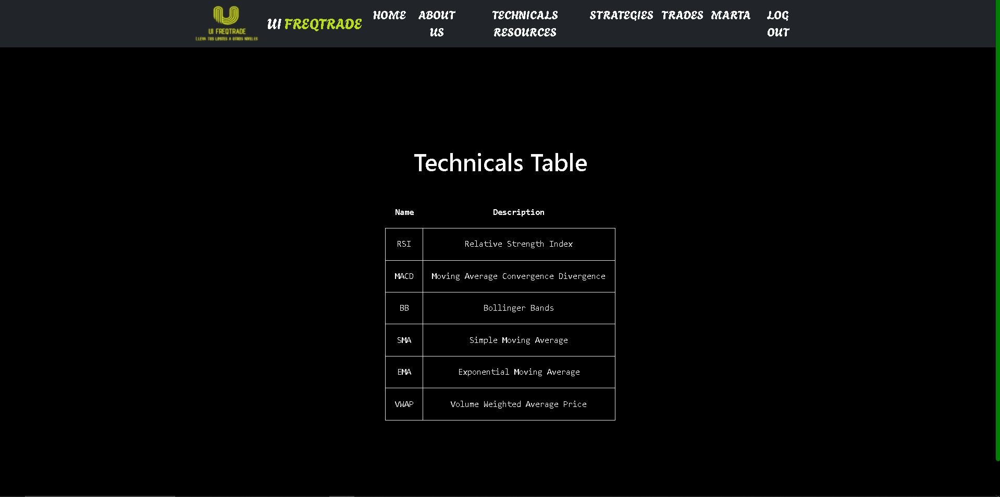

Vista de Estrategias

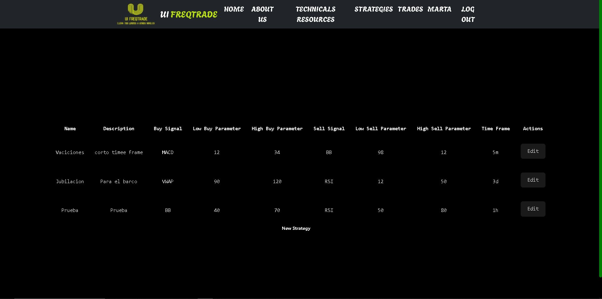

Vista de edicion de estrategia

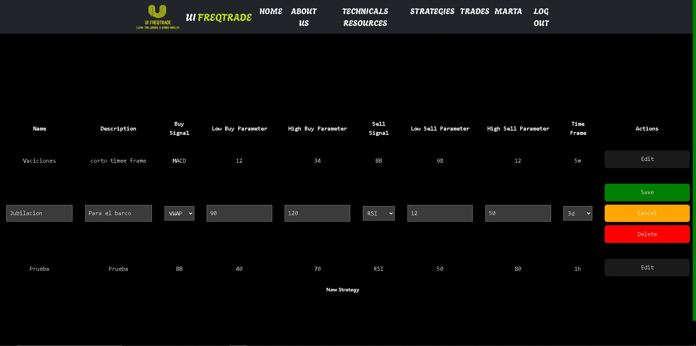

###### Panel de admin

Vista del panel de admin

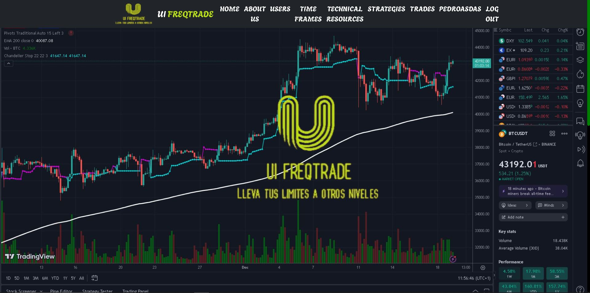

Vista Profile de Admin

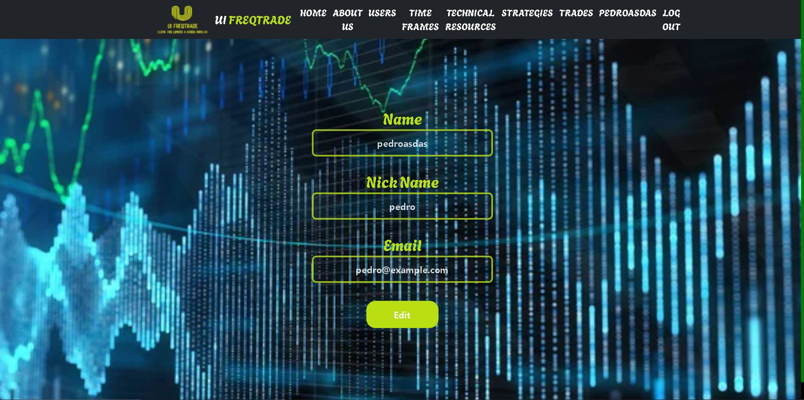

Vista Users

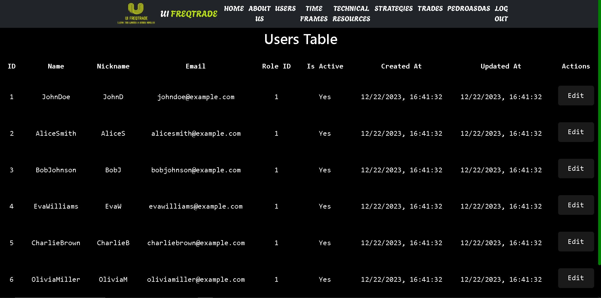

Vista Technicals Resources

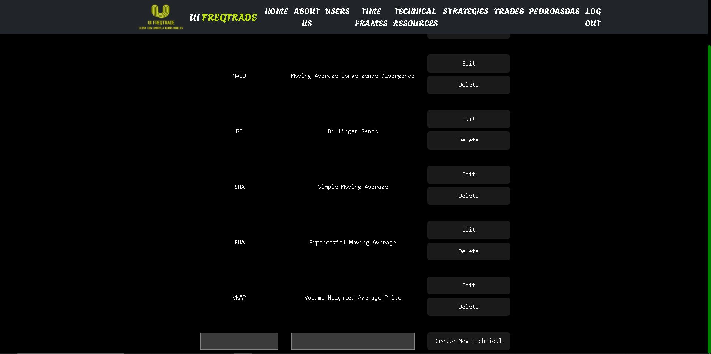

Vista Time Frames

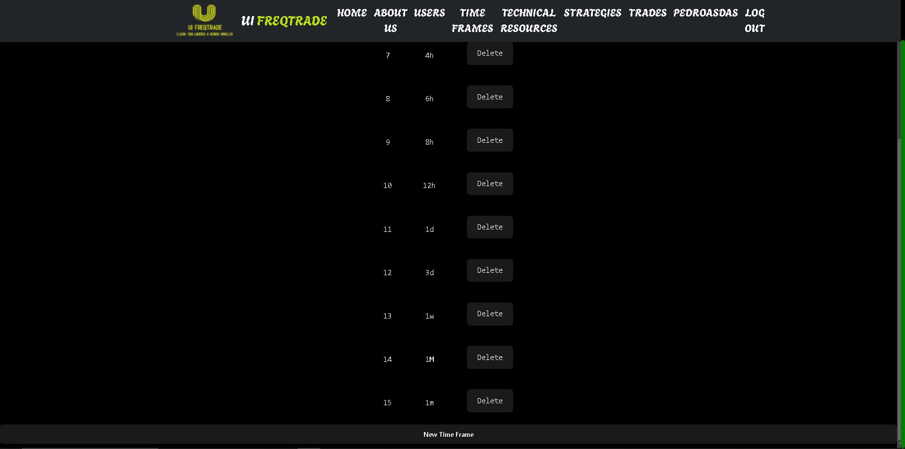

Vista Strategies

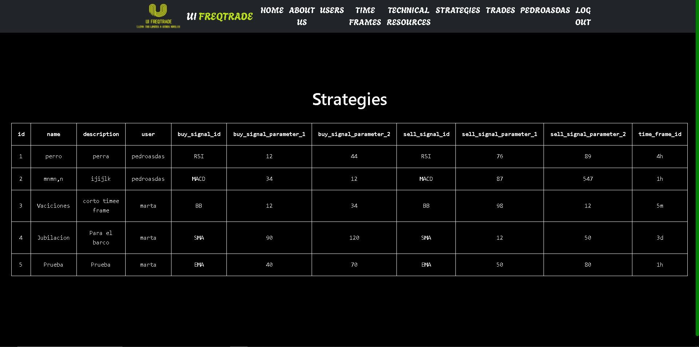

### Observaciones

- ��Ha sido un trabajo durisimo, aun con todas las ayudas al alcance, Stack overflow, youtube...han sido dos semanas de dedicacion plena a este inicio de proyecto, al menos espero que os guste :).  

- ��Todo el codigo ha sido creado en em's.
- ��Necesito mas tiempo para poder implementar mas funcionalidades y perfeccionar el aspecto visual.

 

### Cambios pendientes

- ��Mejorar el responsive.
- ��Mejorar la edicion de campos con mas opciones.
- ��Pulir los estilos porque hay muchos repetidos y que no se aplican.
- ��Volver a repasar el backend para mejorar las API calls y la obtencion de datos.
- ��Añadir funcionalidad para que se puedan ejecutar las estrategias, primero en backtesting y posteriormente en el mercado real.

### Agradecimientos

A toda esos heroes anonimos que suben trocitos de codigo a internet y hace la vida mucho mas facil a los estudintes.
​
​

### Licencia y copyright

📝 La licencia utilizada es una MIT License.
Este proyecto ha sido realizado pixel a pixel por mi, para completar el BootCamp Full Stack de GeeksHubs Academy Valencia.